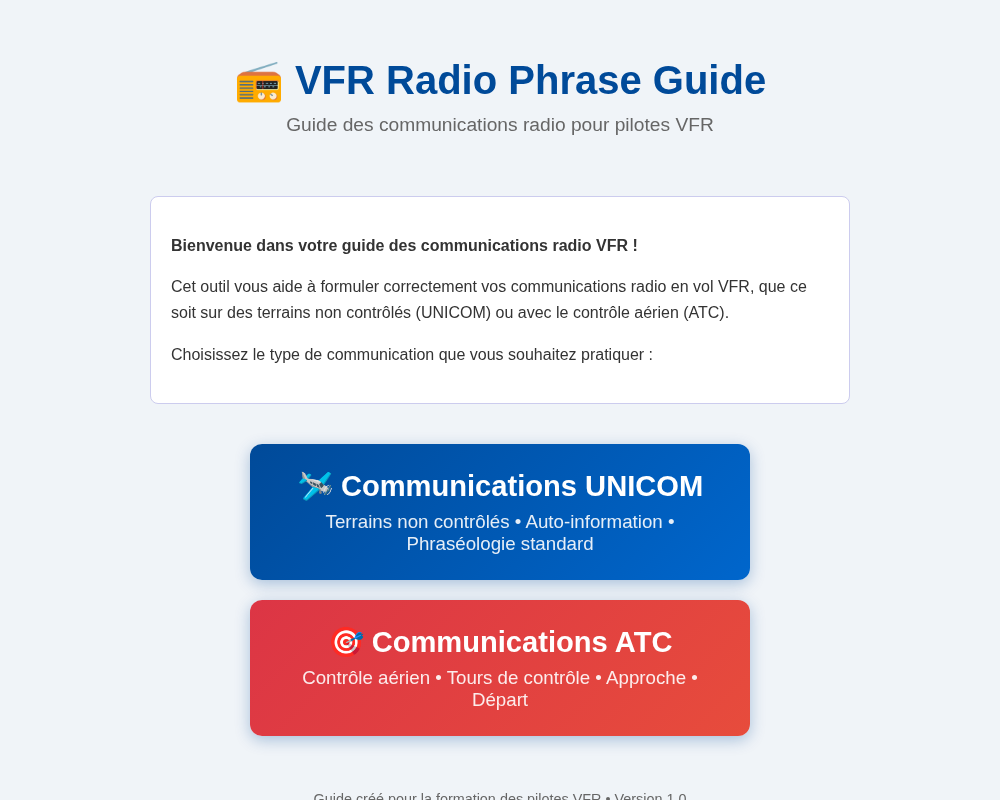
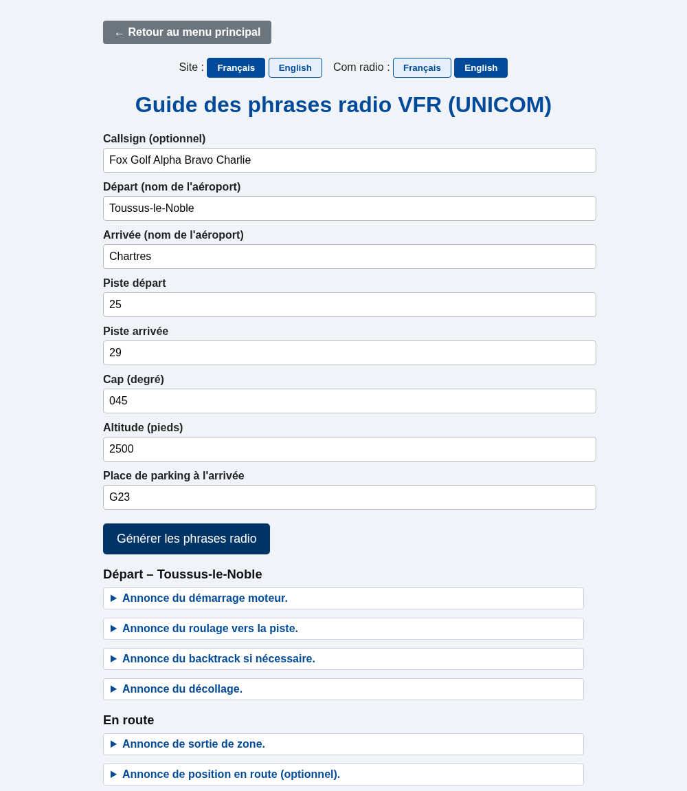
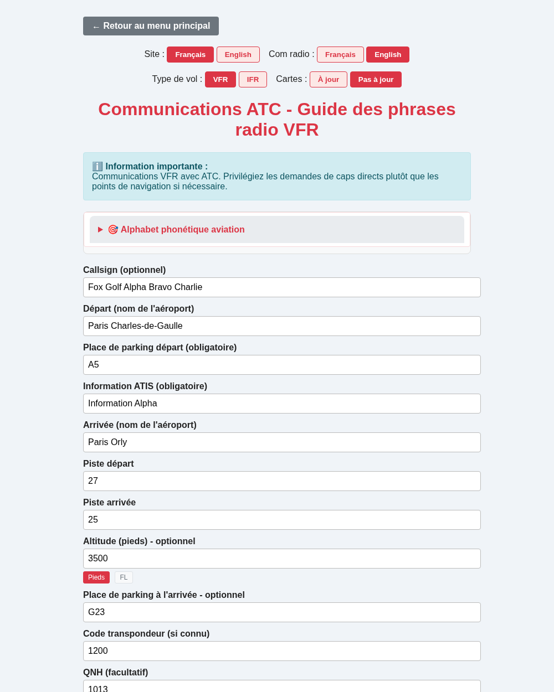

<p align="center">
  
</p>

<p align="center">
  <a href="https://estemobs.github.io/vfr-radio-phrase-guide/"></a>
  
  
</p>

<p align="center">
  <b>👉 <a href="https://estemobs.github.io/vfr-radio-phrase-guide/">estemobs.github.io/vfr-radio-phrase-guide</a> 👈</b>
</p>

<p align="center">
  <button onclick="document.getElementById('readme-fr').style.display='block';document.getElementById('readme-en').style.display='none';">🇫🇷 Français</button>
  <button onclick="document.getElementById('readme-fr').style.display='none';document.getElementById('readme-en').style.display='block';">🇬🇧 English</button>
</p>

## Aperçu / Preview

<table>
<tr>
<td align="center" width="33%"><br><sub>Accueil</sub></td>
<td align="center" width="33%"><br><sub>UNICOM</sub></td>
<td align="center" width="33%"><br><sub>ATC</sub></td>
</tr>
</table>

<div id="readme-fr">

# Guide des phrases radio VFR (UNICOM)

## Description

Ce projet est un générateur interactif de phrases radio VFR pour l’auto-information (UNICOM), destiné aux pilotes VFR en France et à l’international.  
Il permet de générer rapidement les annonces radio types pour chaque phase du vol, en français ou en anglais, avec des explications claires et des cas particuliers (remise de gaz, changement de destination, mayday, etc.).

## Fonctionnalités

- Génération automatique des phrases radio selon vos paramètres (aéroports, piste, altitude, etc.)
- Choix de la langue du site (français/anglais) et de la langue des communications radio (français/anglais)
- Explications détaillées pour chaque étape et situation particulière
- Catégorie "Facultatif" pour les situations spéciales (test radio, changement de destination, remise de gaz, mayday, etc.)
- Interface simple et accessible depuis un navigateur

## Installation

1. **Cloner le dépôt ou télécharger les fichiers**
   ```bash
   git clone <url-du-repo>
   ```
   ou téléchargez et extrayez l’archive ZIP.

2. **Ouvrir le projet**
   - Ouvrez le dossier du projet dans votre éditeur ou gestionnaire de fichiers.

3. **Lancer l’application**
   - Ouvrez le fichier `index.html` dans votre navigateur web préféré (aucune installation supplémentaire n’est nécessaire).

## Utilisation

1. **Remplissez les champs du formulaire** :
   - Callsign (optionnel, un indicatif par défaut sera utilisé si vide)
   - Départ et arrivée (nom des aéroports)
   - Piste, cap, altitude, vent arrière (left/right), place de parking

2. **Choisissez la langue du site et la langue des communications radio** :
   - Utilisez les boutons en haut de page pour basculer entre français et anglais.

3. **Cliquez sur "Générer les phrases radio"** :
   - Les phrases types s’affichent, classées par étape du vol et accompagnées d’explications.
   - Une section "Facultatif / Situations particulières" propose les annonces pour les cas spéciaux (test radio, changement de destination, remise de gaz, touch & go, arrêt complet, urgence).

## Exemples de situations couvertes

- Départ : mise en route, roulage, backtrack, décollage
- En route : sortie de zone, position
- Arrivée : 10 NM, vent arrière, base, finale, dégagement piste, roulage parking
- Facultatif : test radio, changement de destination, remise de gaz, touch & go, arrêt complet, mayday

## Roadmap

- [x] Déploiement en ligne (GitHub Pages)
- [ ] Mode PWA installable, pour un usage hors-ligne en vol

## Contribution

Les contributions sont les bienvenues !  
N’hésitez pas à proposer des améliorations, corriger des bugs ou ajouter de nouveaux cas radio.

1. Forkez le projet
2. Créez une branche pour votre fonctionnalité (`git checkout -b feature/ma-fonctionnalite`)
3. Commitez vos modifications (`git commit -am 'Ajout de ma fonctionnalité'`)
4. Poussez la branche (`git push origin feature/ma-fonctionnalite`)
5. Ouvrez une Pull Request

## Licence

Ce projet est open-source, sous licence MIT.

---

**Auteur :**  
Développé pour aider les pilotes VFR à préparer et standardiser leurs communications radio en auto-info/UNICOM.

</div>

<div id="readme-en" style="display:none">

# VFR Radio Phrase Guide (UNICOM)

## Description

This project is an interactive generator for VFR radio phrases for self-information (UNICOM), designed for VFR pilots in France and internationally.  
It allows you to quickly generate standard radio calls for each flight phase, in French or English, with clear explanations and special cases (go-around, destination change, mayday, etc.).

## Features

- Automatic generation of radio phrases based on your parameters (airports, runway, altitude, etc.)
- Choice of site language (French/English) and radio communication language (French/English)
- Detailed explanations for each step and special situation
- "Optional" category for special situations (radio check, destination change, go-around, mayday, etc.)
- Simple interface accessible from any browser

## Installation

1. **Clone the repository or download the files**
   ```bash
   git clone <repo-url>
   ```
   or download and extract the ZIP archive.

2. **Open the project**
   - Open the project folder in your editor or file manager.

3. **Launch the application**
   - Open the `index.html` file in your preferred web browser (no additional installation required).

## Usage

1. **Fill in the form fields**:
   - Callsign (optional, a default callsign will be used if left blank)
   - Departure and arrival (airport names)
   - Runway, heading, altitude, downwind (left/right), parking spot

2. **Choose the site language and radio communication language**:
   - Use the buttons at the top of the page to switch between French and English.

3. **Click "Generate radio phrases"**:
   - The standard phrases will be displayed, organized by flight phase and with explanations.
   - An "Optional / Special situations" section provides calls for special cases (radio check, destination change, go-around, touch & go, full stop, emergency).

## Example situations covered

- Departure: engine start, taxi, backtrack, takeoff
- Enroute: leaving the area, position report
- Arrival: 10 NM, downwind, base, final, runway vacated, taxi to parking
- Optional: radio check, destination change, go-around, touch & go, full stop, mayday

## Roadmap

- [x] Online deployment (GitHub Pages)
- [ ] Installable PWA mode, for offline use in flight

## Contributing

Contributions are welcome!  
Feel free to suggest improvements, fix bugs, or add new radio cases.

1. Fork the project
2. Create a branch for your feature (`git checkout -b feature/my-feature`)
3. Commit your changes (`git commit -am 'Add my feature'`)
4. Push the branch (`git push origin feature/my-feature`)
5. Open a Pull Request

## License

This project is open-source, under the MIT license.

---

**Author:**  
Developed to help VFR pilots prepare and standardize their radio communications in self-information/UNICOM.

</div>
